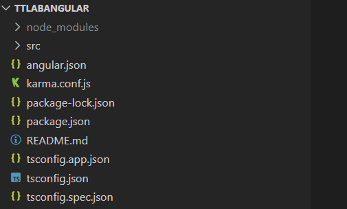

## Subject-One

1. **I understand ........**

    
    
    Description
    I would like to talk about the following:  
    - _src/_ : ...  
    - _README.md_: ...  
    - _node\_modules_: ...    

2. **I can ....**

    2.1 ``ng new ttAngular``  
    

    The command above is used to create a new Angular application by name _ttAngular_
